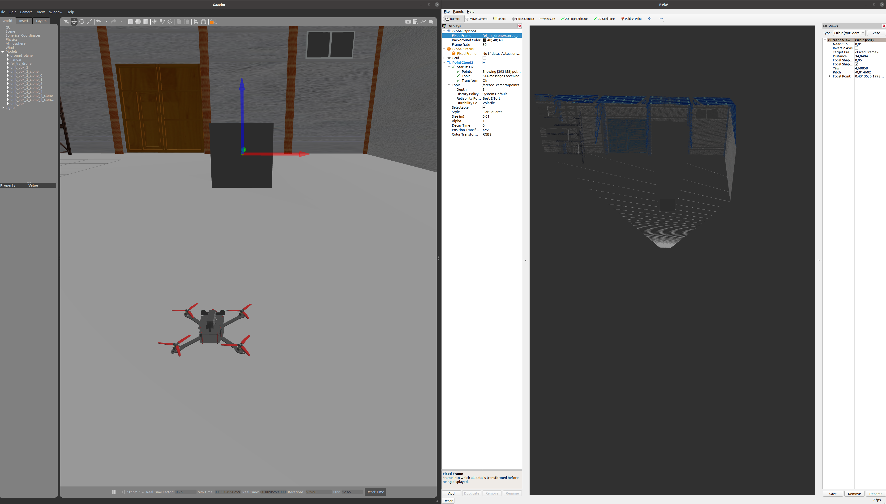

# Simple obstacle avoidance
### **Project specification**

1. __Pointcloud loading from ROS node.__ 
- Subscribe to pointcloud topic and handle incoming data. 
2. __Obstacle detection.__
- Process incoming pointcloud and find obstacle. 
- Inform user with print (std::cout) or similar.
- Obstacle detection should be stable, some false obstacle detections will be tolerated but the detection "noise" should be as minimal as possible.
3. __Path replanning__. 
- Generate new location, where the drone should flight to avoid obstacle. 
- It is possible to use preprogrammed moves, but more complex solutions are welcomed. 
4. __Flight with path replanning__. 
- Achieve flight from point A to point B, with obstacle avoidance (path replanning). Trajectory between point A and B will be straight line, you can expect, that the drone will start in point A (you don't have to fly to point A first).


#### **Assignment points**
- Each section will be awarded 1/4 of total points (35), points for the last section will be awarded only if other sections are completed.
- **Minimal requirement is to have at least of 50% of points from this assignment, it is possible to achieve this by completing 1. and 2. part of the mission (refer to video ([video](../resources/simple_obstacle_avoidance_minimal.mkv)), which illustrates minimal assignment conditions to get 50% points).**
- It is possible to achieve 75% of the points by completing 1., 2. and 3. part of the assignemt without flying. To get this points you will have to demonstrate, that you are able to plan where your drone should flight next to avoid the obstacle (should be x,y,z point).   
- To get all the points your drone should be able to complete the mission "autonomously". 

#### **Notes**
- Pointcloud is calculated from disparity, so you can check if everything is OK with 'rosrun image_view stereo_view stereo:=/fei_lrs_drone/stereo_camera image:=image_rect_color' .
- **Disparity won't be calculated if you are too close to an obstacle.**
- It is possible to `"point cloud2 iterators"`, but you can iterate `sensor_msgs::PointCloud2` on your own too. (this is part of assinment so no more information will be provided)
- You can use this snipped to create subscriber to topic (you need to integrate it into example ROS node or to your own ROS node): 

### Installation guide
1. Clone this latest repository.
2. Install additional dependencies.
 ```
sudo apt install ros-foxy-gazebo-ros-pkgs # if there will be error please tell me and i will help
sudo apt install ros-foxy-image-pipeline
sudo apt install ros-foxy-rviz2
```
3. Now you should see with `ros2 topic list`:
```/clicked_point
/clock
/goal_pose
/initialpose
/parameter_events
/rosout
/stereo_camera/camera_info
/stereo_camera/depth/camera_info
/stereo_camera/depth/image_raw
/stereo_camera/image_raw
/stereo_camera/points
/tf
/tf_static
```
4. Now you can open rviz2, with `rviz2` command.
- At global options set Fixed frame to: fei_lrs_drone/stereo_cam_link
- Add with button add topic `/stereo_camera/points'
  - Click on button add (bottom of the window) -> click by topic -> add /points
5. If everything works, you can see a similar image to this one 
6. You can start to implement your solution. 
- It is good to write subscriber to `/stereo_camera/points` first. To check the datatype you can use `ros2 topic type /stereo_camera/points` 
