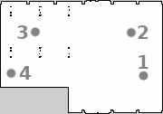

### **Project specification**

1. __Map handling.__
    - implementation or tool - map loading - **required**
    - implementation of obstacle inflation - **required**
    - implementation of map transformations, rotations etc. - **if needed**
2. __Map search algorithm. (Path finding)__
    - implementation or tool - path finding/search algorithm - **required**
        - Flood fill, RRT, A*...
3. __Trajectory planning.__
    - implementation or tool - optimization of path - **if needed**
        - minimal requirement - elimination of not necessary points (elimination of sequences of horizontal, vertical, diagonal paths...)          
4. __ROS Drone control node__
    - implementation - trajectory loading - **required**
    - implementation - mission tasks/commands - **required**
    - implementation - position controller - **required** 
5. __Point specification/task/command__
    - implementation - land and takeoff - **required**
    - implementation - point radius (precision of position controller for given point - Hard/Soft) - **required**
    - implementation - yaw control in a specific angle - **required**
6. __Documentation__ 
    - analysis of each used approach - **required**
        - pros and cons
        - explanation of the algorithms or implementations
    - overal solution diagram - **required**
        - data processing paths
        - ROS Drone control diagram

_Note: Map search algorithm and some parts of Trajectory planning can be implemented in one method, if you choose so._
_Note: If a software tool is used, it must be well documented and explained in documentation._

### **Example mission** 

|| X | Y | Z | Precision| Task |
|---| ---      | ---      | ---      |---  |--- |
|1| x0  | y0   | 2   | - |takeoff |
|2| x1 | y1 | 2 | soft | yaw 90 |
|3| x2   |   y2    |2   | hard   |land and takeoff |
|4| x3 | y3 | 1| soft| - | 

### **Example mission 2** 
[Link to file](resources/points_example.csv)

|| X | Y | Z | Precision| Task |
|---| ---      | ---      | ---      |---  |--- |
|1|13.00|7.00|2.00|soft|takeoff|
|2|8.65|2.02|1.39|soft|-|
|3|4.84|5.37|0.42|hard|-|
|4|2.08|9.74|1.46|hard|-|
|5|8.84|6.90|2.00|hard|landtakeoff|
|6|2.81|8.15|2.27|soft|-|
|7|13.00|7.00|2.00|hard|land|
